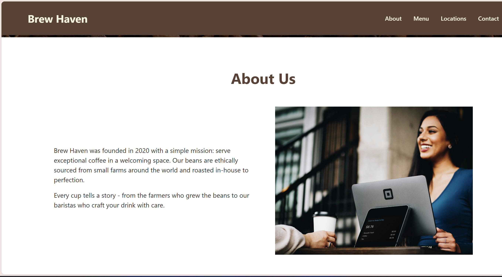
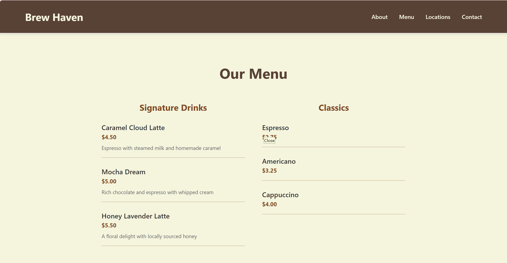
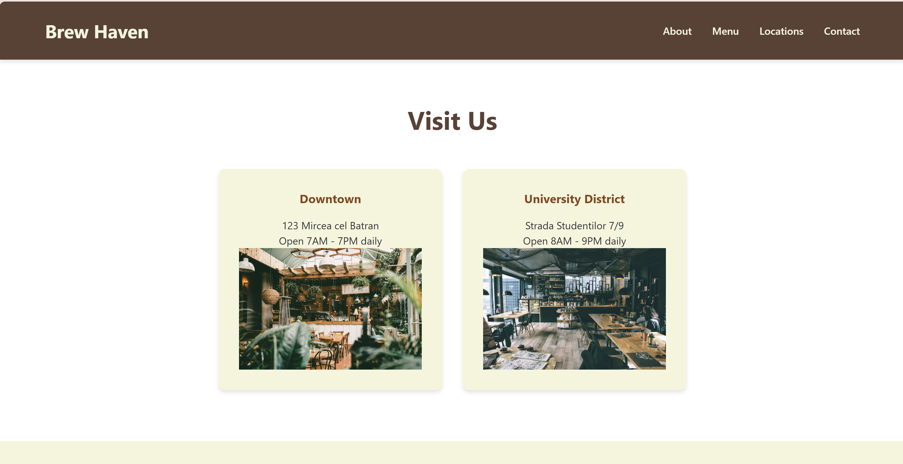
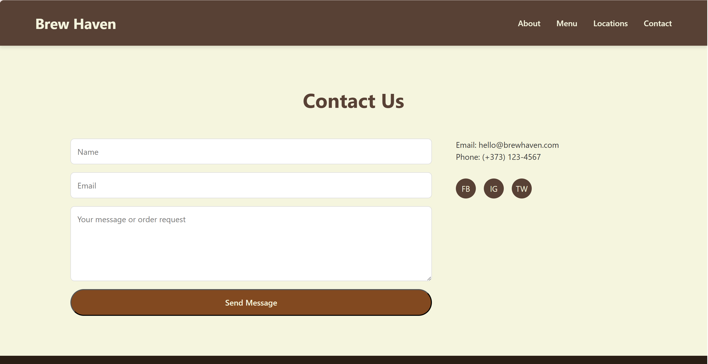

# Brew Haven Coffee Shop Landing Page

A responsive landing page for a fictional specialty coffee shop called "Brew Haven". This project was created as part of a web programming laboratory assignment using vanilla HTML and CSS.

## Screenshots

## Live Demo

[View the live demo](https://youtu.be/PKpy272qn6g)

## Website

[View the website](https://anacalugareanu.github.io/PWeb/)

## Features

- Responsive design that works on mobile and desktop
- Navigation bar with smooth scrolling to page sections
- Call-to-action buttons to encourage visitor engagement
- Four main sections: Hero, About, Menu, Locations, and Contact
- Contact form for customer inquiries
- Designed with accessibility and user experience in mind

## Technologies Used

- HTML5
- CSS3 (Vanilla, no frameworks)
- Git for version control

## Setup Instructions

1. Clone this repository
2. Open index.html in your browser

## Project Structure
tum-web-lab2/          # Root project directory
│── images/            # Contains all images (logos, backgrounds, UI assets, screenshots)
│   ├── Screenshot1.png
│   ├── Screenshot2.png
│   ├── Screenshot3.png
│   ├── Screenshot4.png
│   ├── Screenshot5.png
│   ├── 1.jpg
│   ├── 2.jpg
│   ├── 3.jpg
│   ├── 4.jpg
│── index.html         # Main HTML file (landing page)
│── README.md          # Project documentation (this file)
│── reset.css          # CSS reset file (optional, for consistent styling)
│── styles.css         # Main CSS file
